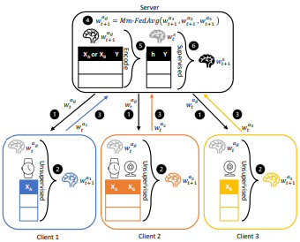

# Federated Learning on Multimodal Sensor Data

UMass Amherst ECE535: Networked Embedded System Design Fall 2023

## Authors

- [@CDelSignore](https://www.github.com/CDelSignore) - Responsible for everything because it's a group of 1.

## Motivation

Machine learning has become an increasingly crucial skill in the embedded domain, which has not yet been reflected in the UMass curriculum. Having worked at a company that designs sensor systems for data logging, I am interested to explore federated learning and see if it might provide key advantages for such a system.

## Design Goals

* Implement per-class accuracy reporting
* Analyze the train and test data distribution
* Visualize and report findings

## Deliverables

* Understand multimodal federated learning
* Reproduce the results of the underlying research paper
* Perform per-class accuracy analysis and observe effect of skewed data distribution
* Evaluate the system on a multimodal dataset that is relatively balance in class distribution

## Requirements

* [IoT Dataset](https://drive.google.com/drive/folders/1rWJYkfMavGs1F-H0jykJ5V0fIiwrQdJV)
* Anaconda 3
* Python 3.7+
* Pytorch 1.8+
* Torchvision 0.9+
* Numpy 1.19+
* Matplotlib 3.3+
* Scipy 1.4+
* MPI for Python 3.0+

## System Blocks

Borrowed from the original research:  



## Timeline

[09/26/23] - Project proposal  
[09/27/23] - Create repository  
[10/01/23] - Complete foundational research

Other timeframes to be decided when information posted to Moodle

## References

 - [Underlying Research Paper](https://arxiv.org/pdf/2109.04833.pdf)
 - [Underlying Code Repository](https://github.com/yuchenzhao/iotdi22-mmfl)
 - [Deep Learning Fundamentals](https://www.youtube.com/watch?v=gZmobeGL0Yg&list=PLZbbT5o_s2xq7LwI2y8_QtvuXZedL6tQU)
 - [PyTorch Fundamentals](https://www.youtube.com/watch?v=v5cngxo4mIg&list=PLZbbT5o_s2xrfNyHZsM6ufI0iZENK9xgG)
 - [Federated Learning Fundamentals](https://www.youtube.com/watch?v=X8YYWunttOY)
 - [Federated Learning Research](http://proceedings.mlr.press/v54/mcmahan17a/mcmahan17a.pdf)

# ECE 535 Project Check In

Collin DelSignore (30800923)  
Federated Learning on Multimodal Sensor Data

## Setup & Research

I spent a lot of time reading the source paper and seeking out additional publications to understand what Federated Learning is, why it's important and relevant, and what the significance of this particular project is.

For setup, I created a Windows Subsystem for Linux (WSL) installation of Ubuntu and installed Miniconda to help control the dependencies for the project, using the suggested deep-learning Conda environment. I have a working installation with the proper data and paths configured, and am currently porting everything to a dedicated Ubuntu Server host so that I can SSH into my project from campus.

## Implementation

The provided code for `Main.py` did not work for me out of the box. In particular:
```python
return np.mean(win_loss), np.mean(win_accuracy), np.mean(win_f1)
```
was returning an error because `win_weighted_f1` was undefined in this scope. Looking through the file, I noticed:
```python 
win_f1.append(weighted_f1)
```
Substituting for this `win_f1` variable allowed my models to train. I created a bash script to index all the config files and modified my `Main.py` to accept parameterized file paths. This way I was able to "set and forget" my machine and train all the datasets in series. However, I ran into additional roadblocks when running the analysis. It seems that within `fl.py`, there is a check for `self.is_mpi`, which is FALSE. This means that there is no "rep_x" appended to the filepath. There is no such check in `analysis.py`, meaning that it cannot find the results files for analysis. I changed those lines of code and was able to run analysis.

## Deliverables

Over the next few days, I am hoping to finish verifying that my analysis matches the paper. Initial checks seem to indicate that there are minor differences, but I haven't explored the accuracy particularly closely yet.

Main deliverables before the next check in are to complete the differential analysis and to begin modifying to attain per-class accuracy. In addition, once the remote server is set up, I am going to begin taking better advantage of `Git` to manage the local repository and send upstream to the created Github repo. As it stands, I have been working locally since I am in a team by myself.

One of my groupmates for the 535 discussion is also working by himself on this topic, and asked if he could join this project. If his request is approved, I will expand the deliverables to reflect the increased output potential of a 2-person group.
